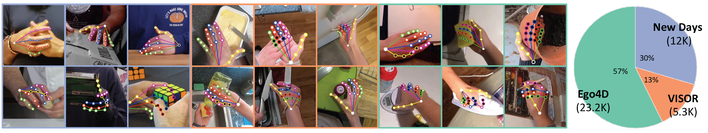

# HInt: <ins>H</ins>and <ins>Int</ins>eractions in the wild
Data repository for the paper: **Reconstructing Hands in 3D with Transformers**

[Georgios Pavlakos](https://geopavlakos.github.io/), [Dandan Shan](https://ddshan.github.io/), [Ilija Radosavovic](https://people.eecs.berkeley.edu/~ilija/), [Angjoo Kanazawa](https://people.eecs.berkeley.edu/~kanazawa/), [David Fouhey](https://cs.nyu.edu/~fouhey/), [Jitendra Malik](http://people.eecs.berkeley.edu/~malik/)

[](https://arxiv.org/pdf/2312.05251.pdf)  [](https://geopavlakos.github.io/hamer/)     [](https://colab.research.google.com/drive/1rQbQzegFWGVOm1n1d-S6koOWDo7F2ucu?usp=sharing)  [](https://huggingface.co/spaces/geopavlakos/HaMeR)




## Overview
The HInt dataset is contributed in the paper, **Reconstructing Hands in 3D with Transformers**, with
the goal to complement existing datasets used for training and evaluation 3D hand pose estimation. 

HInt annotates 2D keypoint locations and occlusion labels for 21 keypoints on the hand.
It is built off of 3 existing datasets ([Hands23](), [Epic-Kitchens VISOR](https://epic-kitchens.github.io/VISOR/), and [Ego4D](https://ego4d-data.org/)) and provides annotations for images from the three existing datasets. 

## Prepare HInt Dataset 
### Step 1: download partial HInt
Download Hint_annotation_partial.zip which contains all annotations, New Days and Epic-Kitchens VISOR image frames. That's said, this zip file contains everything except the Ego4D frames duo to Ego4D license constraint.
```
wget https://fouheylab.eecs.umich.edu/~dandans/projects/hamer/HInt_annotation_partial.zip
unzip HInt_annotation_partial.zip
```
After unzip, the folder structure will be as below. Each folder contains the `.jpg` image and `.json` annotation pairs except Ego4D directories (noted with * at the end) are missing `.jpg` frames. We provide instructions on how to retrieve Ego4D frames in Step 2 down below. 
```
HInt_annotation_partial
├── TEST_ego4d_img*
├── TEST_ego4d_seq*
├── TEST_epick_img
├── TEST_newdays_img
├── TRAIN_ego4d_img*
├── TRAIN_epick_img
├── TRAIN_newdays_img
├── VAL_ego4d_img*
├── VAL_ego4d_seq*
├── VAL_epick_img
└── VAL_newdays_img
```


### Step 2: prepare Ego4D frames
1. Get access. Follow the [Start Here](https://ego4d-data.org/docs/start-here/) page on Ego4D official website to get download access. 

The process will be like: submit your information form -> wait for the mail about the agreement -> review and accept the terms of Ego4D license agreement. If your license agreement is approved, you will receive an email from Ego4D about the AWS access credentials. As it mentioned, this process might take ~48 hours so do it earlier. 

2. Set up Ego4D CLI. Follow [Ego4D Dataset Download CLI](https://github.com/facebookresearch/Ego4d/blob/main/ego4d/cli/README.md) to set up your CLI to get ready for downloading.

3. Download Ego4D clips. The clips will be saved under `/path/to/ego4d_data/v1/clips`
```
ego4d --output_directory="/path/to/save/ego4d_data" --version v1 --datasets clips annotations --metadata 
```

4. Decode Ego4D clips. Set the `ego4d_root` and `hint_root` in the argparse first. The decoded clips will be saved under `/path/to/ego4d_data/v1/clips_decode`. \
This script is dependent on [ffmpeg](https://github.com/conda-forge/ffmpeg-feedstock) library, you can install it by `conda install ffmpeg=5.1.2` (a tested version).
```
cd prep_HInt
python prep_ego4d.py --task=decode_clips
```

5. Retrieve Ego4D frames. Fill Ego4D frames in Ego4D folders under `HInt_annotation_partial`. Once it passed the file amount checking, the dataset folder name` HInt_annotation_partial` will be updated to `HInt_annotation`.
```
python prep_ego4d.py --task=retrieve_frames
```

6. Check [MD5](https://en.wikipedia.org/wiki/MD5) to verify data integrity. Compare MD5 of zip files between your generated HInt and the original one. Make sure you pass it first especially before you use the Ego4D subset of HInt.
```
python prep_ego4d.py --task=verify_hint
```


## Visualize HInt Annotations

Plot annotations on images. This script is dependent on [mmengine](https://mmengine.readthedocs.io/en/v0.8.1/get_started/installation.html) library, you can install it simply by `pip install mmengine`.
```
cd visualize_HInt
python draw_hand.py
```


## Citing
If you find this data useful for your research, please consider citing the following paper. If you have questions about the dataset, feel free to email Dandan Shan.

HaMeR
```bibtex
@inproceedings{pavlakos2024reconstructing,
    title={Reconstructing Hands in 3{D} with Transformers},
    author={Pavlakos, Georgios and Shan, Dandan and Radosavovic, Ilija and Kanazawa, Angjoo and Fouhey, David and Malik, Jitendra},
    booktitle={CVPR},
    year={2024}
}
```
Epic-Kitchens VISOR
```bibtex
@article{darkhalil2022epic,
  title={Epic-kitchens visor benchmark: Video segmentations and object relations},
  author={Darkhalil, Ahmad and Shan, Dandan and Zhu, Bin and Ma, Jian and Kar, Amlan and Higgins, Richard and Fidler, Sanja and Fouhey, David and Damen, Dima},
  journal={Advances in Neural Information Processing Systems},
  volume={35},
  pages={13745--13758},
  year={2022}
}
```

Ego4D
```bibtex
@inproceedings{grauman2022ego4d,
  title={Ego4d: Around the world in 3,000 hours of egocentric video},
  author={Grauman, Kristen and Westbury, Andrew and Byrne, Eugene and Chavis, Zachary and Furnari, Antonino and Girdhar, Rohit and Hamburger, Jackson and Jiang, Hao and Liu, Miao and Liu, Xingyu and others},
  booktitle={Proceedings of the IEEE/CVF Conference on Computer Vision and Pattern Recognition},
  pages={18995--19012},
  year={2022}
}
```


